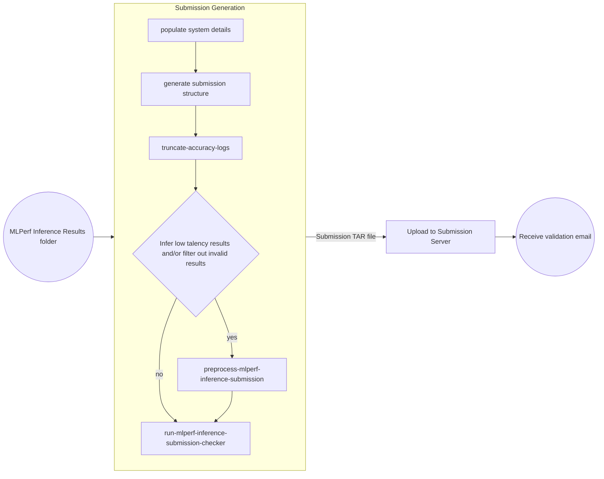

---
hide:
  - toc
---



Click [here](https://youtu.be/eI1Hoecc3ho) to view the recording of the workshop: Streamlining your MLPerf Inference results using CM.

Click [here](https://docs.google.com/presentation/d/1cmbpZUpVr78EIrhzyMBnnWnjJrD-mZ2vmSb-yETkTA8/edit?usp=sharing) to view the prposal slide for Common Automation for MLPerf Inference Submission Generation through CM.

=== "CM based results"
    If you have followed the `cm run` commands under the individual model pages in the [benchmarks](../index.md) directory, all the valid results will get aggregated to the `cm cache` folder. The following command could be used to browse the structure of inference results folder generated by CM.
    ### Get results folder structure
    ```bash
    cm find cache --tags=get,mlperf,inference,results,dir | xargs tree
    ```
=== "Non CM based results"
    If you have not followed the `cm run` commands under the individual model pages in the [benchmarks](../index.md) directory, please make sure that the result directory is structured in the following way. 
    ```
    └── System description ID(SUT Name)
        ├── system_meta.json
        └── Benchmark
            └── Scenario
                ├── Performance
                |   └── run_x/#1 run for all scenarios
                |       ├── mlperf_log_summary.txt
                |       └── mlperf_log_detail.txt
                ├── Accuracy
                |   ├── mlperf_log_summary.txt
                |   ├── mlperf_log_detail.txt
                |   ├── mlperf_log_accuracy.json
                |   └── accuracy.txt
                |── Compliance_Test_ID
                |   ├── Performance
                |   |   └── run_x/#1 run for all scenarios
                |   |       ├── mlperf_log_summary.txt
                |   |       └── mlperf_log_detail.txt
                |   ├── Accuracy
                |   |   ├── baseline_accuracy.txt
                |   |   ├── compliance_accuracy.txt
                |   |   ├── mlperf_log_accuracy.json
                |   |   └── accuracy.txt
                |   ├── verify_performance.txt
                |   └── verify_accuracy.txt #for TEST01 only
                |── user.conf
                └── measurements.json
    ```
    
    <details>
    <summary>Click here if you are submitting in open division</summary>

    * The `model_mapping.json` should be included inside the SUT folder which is used to map the custom model full name to the official model name. The format of json file is:

    ```
        {
            "custom_model_name_for_model1":"official_model_name_for_model1",
            "custom_model_name_for_model2":"official_model_name_for_model2",

        }
    ```
    </details>

Once all the results across all the models are ready you can use the following command to generate a valid submission tree compliant with the [MLPerf requirements](https://github.com/mlcommons/policies/blob/master/submission_rules.adoc#inference-1).

## Generate actual submission tree

=== "Docker run"
    ### Docker run
    === "Closed"
        ### Closed Submission
        ```bash
        cm docker script --tags=generate,inference,submission \
            --clean \
            --preprocess_submission=yes \
            --run-checker \
            --submitter=MLCommons \
            --tar=yes \
            --env.CM_TAR_OUTFILE=submission.tar.gz \
            --division=closed \
            --env.CM_DETERMINE_MEMORY_CONFIGURATION=yes \
            --quiet
        ```

    === "Open"
        ### Open Submission
        ```bash
        cm docker script --tags=generate,inference,submission \
            --clean \
            --preprocess_submission=yes \
            --run-checker \
            --submitter=MLCommons \
            --tar=yes \
            --env.CM_TAR_OUTFILE=submission.tar.gz \
            --division=open \
            --env.CM_DETERMINE_MEMORY_CONFIGURATION=yes \
            --quiet
        ```

=== "Native run"
    ### Native run
    === "Closed"
        ### Closed Submission
        ```bash
        cm run script --tags=generate,inference,submission \
            --clean \
            --preprocess_submission=yes \
            --run-checker \
            --submitter=MLCommons \
            --tar=yes \
            --env.CM_TAR_OUTFILE=submission.tar.gz \
            --division=closed \
            --env.CM_DETERMINE_MEMORY_CONFIGURATION=yes \
            --quiet
        ```

    === "Open"
        ### Open Submission
        ```bash
        cm run script --tags=generate,inference,submission \
            --clean \
            --preprocess_submission=yes \
            --run-checker \
            --submitter=MLCommons \
            --tar=yes \
            --env.CM_TAR_OUTFILE=submission.tar.gz \
            --division=open \
            --env.CM_DETERMINE_MEMORY_CONFIGURATION=yes \
            --quiet
        ```

* Use `--hw_name="My system name"` to give a meaningful system name. Examples can be seen [here](https://github.com/mlcommons/inference_results_v3.0/tree/main/open/cTuning/systems)

* Use `--submitter=<Your name>` if your organization is an official MLCommons member and would like to submit under your organization

* Use `--hw_notes_extra` option to add additional notes like `--hw_notes_extra="Result taken by NAME" `

* Use `--results_dir` option to specify the results folder for Non CM based benchmarks

* Use `--category` option to specify the category for which submission is generated(datacenter/edge). By default, the category is taken from `system_meta.json` file located in the SUT root directory.

* Use `--submission_base_dir` to specify the directory to which outputs from preprocess submission script and final submission is to be dumped. No need to provide `--submission_dir` along with this. For `docker run`, use `--submission_base_dir` instead of `--submission_dir`.

The above command should generate "submission.tar.gz" if there are no submission checker issues and you can upload it to the [MLCommons Submission UI](https://submissions-ui.mlcommons.org/submission).

## Aggregate Results in GitHub

If you are collecting results across multiple systems you can generate different submissions and aggregate all of them to a GitHub repository (can be private) and use it to generate a single tar ball which can be uploaded to the [MLCommons Submission UI](https://submissions-ui.mlcommons.org/submission). 

Run the following command after **replacing `--repo_url` with your GitHub repository URL**.

```bash
cm run script --tags=push,github,mlperf,inference,submission \
   --repo_url=https://github.com/GATEOverflow/mlperf_inference_submissions_v4.1 \
   --commit_message="Results on <HW name> added by <Name>" \
   --quiet
```

At the end, you can download the github repo and upload to the [MLCommons Submission UI](https://submissions-ui.mlcommons.org/submission).
