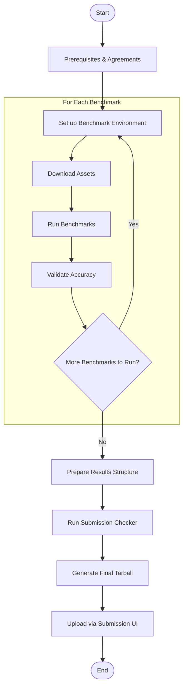

---
hide:
  - toc
---
# MLPerf Inference Submission Guide

This document provides a step-by-step overview of the **MLPerf Inference submission process**.  

---

---

## Table of Contents
- [1. Prerequisites and Agreements](#1-prerequisites-and-agreements)
- [2. Overview of MLPerf Inference Benchmarking](#2-overview-of-mlperf-inference-benchmarking)
- [3. Common Steps in Benchmarking](#3-common-steps-in-benchmarking)
- [4. Preparing Results for Submission](#4-preparing-results-for-submission)
- [5. Manual vs Automated Submission](#5-manual-vs-automated-submission)
- [6. Additional Resources](#6-additional-resources)
- [7. Troubleshooting]()
- [8. Support](#7-support)
- [Notes](#notes)

---

## 1. Prerequisites and Agreements

For doing the MLPerf Inference Submission, ensure that your company is a member of MLCommons and all the **required agreements** are completed. You can skip these if you are doing an unofficial submission.

- **Becoming a member:**

    - Please find more information about becoming a MLCommons member [here](https://mlcommons.org/get-involved/#become-a-member).

- **Sign the relevant agreements:**
  
    - [Contributor License Agreement (CLA)](https://drive.google.com/file/d/1UMzPALp0u35aneASJPa-izxtZWT6GZJb/view)
    - Trademark Agreement (Contact `support@mlcommons.org` to request the trademark agreement.)
    - Power EULA (optional, only if submitting power measurements which can be requested by sending an email to `support@mlcommons.org`)

The submitting organizations/individuals are obliged to follow the below guidelines:

- [**Results Guidelines**](https://github.com/mlcommons/policies/blob/master/MLPerf_Results_Messaging_Guidelines.adoc)
- [**Trademark Guidelines**](https://drive.google.com/file/d/1IkLCv2GYXSMmRWHPK0GEPMdTkb3Nxm8W/view)

---

## 2. Overview of MLPerf Inference Benchmarking

MLPerf Inference is a benchmarking suite designed to measure **performance of machine learning models** on different hardware and software systems.

### Benchmark Timings
- MLPerf Inference benchmarking happens **twice per year**:

      - **.0 Round** – February  
      - **.1 Round** – August  

---

### Categories
Results are grouped into **categories** based on system availability:

- **Available:** All components are available for purchase or rent.  
- **Preview:** Expected to become Available in the next submission round.  
- **Research, Development, or Internal (RDI):** Experimental or internal systems.

---

### System Types
Two system types are supported:

- **Datacenter:** Large-scale server-class systems.  
- **Edge:** Devices and platforms designed for embedded or low-power environments.

The **System Under Test (SUT)** can be classified under either, depending on the use case.

---

### Scenarios
Each benchmark defines one or more **scenarios** to reflect real-world usage.  
See more details [here](https://github.com/mlcommons/inference_policies/blob/master/inference_rules.adoc#3-scenarios)

- **Datacenter:** Offline, Server, Interactive  
- **Edge:** SingleStream, MultiStream, Offline  

Scenario requirements depend on both **system type** and **benchmark model**.  
Refer to the [**Benchmark Info page**](../index.md) for details.

---

### Divisions
MLPerf supports two divisions, allowing flexibility in reimplementation:

- **Closed Division:**  
  Focused on fair “apples-to-apples” comparison using the same model and reference setup. All applicable scenarios for a given benchmark are mandatory to be submitted. 
  See [rules](https://github.com/mlcommons/inference_policies/blob/master/inference_rules.adoc#61-closed-division).

- **Open Division:**  
  Allows innovation such as retraining or model substitution. One or more scenario of any benchmark can be submitted.
  See [rules](https://github.com/mlcommons/inference_policies/blob/master/inference_rules.adoc#63-open-division).

---
### LoadGen (Load Generator)
**LoadGen** is the C++ benchmarking harness (with Python bindings) used across all MLPerf Inference submissions.  
It handles:

- Query generation and scheduling 
- logging  
- Latency tracking  
- Accuracy validation  
- Final metric computation  

---

## 3. Common Steps in Benchmarking

Below are the **general steps** followed in the MLPerf Inference benchmarking process.

1. **Determine Division, System Type, and Category**  
   Decide whether your submission will be Closed/Open, Edge/Datacenter, and Available/Preview/RDI.

2. **Identify Required Scenarios**  
   Based on your chosen configuration, identify which scenarios must be run.

3. **Download Required Resources**

      - **Benchmark Source Repository** ([Reference](https://github.com/mlcommons/inference) or vendor implementation):  

      - **Datasets**  

      - **Models**  

4. **Configure Environment**  
   Set up the required dependencies, environment variables, and system configurations for benchmarking.

      Please refer to [this](https://github.com/mlcommons/mlperf-automations/blob/dev/script/get-mlperf-inference-sut-description/README.md) README for instructions on how to automatically generate the system description file for your SUT.

5. **Run Benchmarks**  
   Execute benchmarks for the required scenarios, divisions, and categories.  
   Adjust target QPS or latency to meet accuracy and performance requirements.  
   *(Refer to model-specific documentations for actual command usage.)*

6. **Run Accuracy Checker**  
   Verify that the output results meet accuracy thresholds.  

7. **Repeat for All Intended Benchmarks**  
   Perform the above steps for every model you plan to submit.

---

## 4. Preparing Results for Submission

After benchmark runs are complete, follow these steps to prepare your submission package.

1. **Arrange Results**  
   Organize results according to the structure defined [here](https://github.com/mlcommons/policies/blob/master/submission_rules.adoc#563-inference).

2. **Preprocess Submission**  
   Use the [preprocessing script](https://github.com/mlcommons/inference/blob/master/tools/submission/preprocess_submission.py) from the inference repository to validate and format results.

3. **Run Submission Checker**  
   The [checker](https://github.com/mlcommons/inference/blob/master/tools/submission/submission_checker.py) validates completeness and correctness, producing a final `.tar.gz` file for submission.

4. **Upload to Submission Portal**  
   Use the MLCommons **Submission UI**, the link to which will be shared at the time of submission, to upload your final tarball.

---

## 5. Manual vs Automated Submission

There are **two ways** to prepare and submit your results:

### Manual Submission
Each of the above steps (from benchmarking to submission) can be performed manually.  
This approach gives full control but is time-consuming and prone to errors.

### Automated Submission (CLI)
MLCommons provides a **Submission CLI** that automates:

- Result structuring
- Preprocessing
- Checker validation
- Final tarball creation and upload

This reduces manual intervention and ensures compliance with submission requirements.  
See [documentation](submission-cli.md) for usage.

---

## 6. Additional Resources

- [**MLPerf General Policies**](https://github.com/mlcommons/policies/tree/master)
- [**MLPerf Inference Policies**](https://github.com/mlcommons/inference_policies/tree/master)  
- [**Reference Implementations**](https://github.com/mlcommons/inference)  
- [**Previous Submission Results**](https://github.com/orgs/mlcommons/repositories?q=inference_results_v)
- [**Submission FAQ**](https://github.com/mlcommons/inference_policies/blob/master/inference_rules.adoc#9-faq)

---

## 7. Troubleshooting

---

## 8. Support

For questions or clarifications:

- Join the [MLPerf Inference mailing list](https://groups.google.com/a/mlcommons.org/g/inference) — you can contact the group via **inference@mlcommons.org**.
- Open an issue in the [inference repository](https://github.com/mlcommons/inference/issues).

---

### Notes
- Ensure that all agreements and contributor information are completed **before** performing any submissions.  
- Always use the **latest round’s branch/tag** for submission.  
- Refer to individual model documentation for scenario-specific configurations.  

---

*This document is maintained by the MLPerf Inference Working Group. For suggestions or updates, please raise a pull request or contact the maintainers.*
