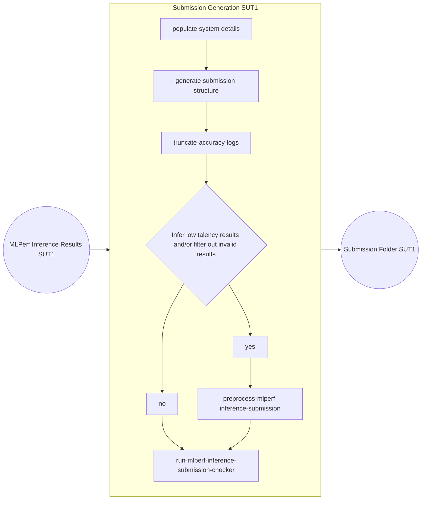

---
hide:
  - toc
---


Click [here](https://docs.google.com/presentation/d/1cmbpZUpVr78EIrhzyMBnnWnjJrD-mZ2vmSb-yETkTA8/edit?usp=sharing) to view the prposal slide for Common Automation for MLPerf Inference Submission Generation through CM.

=== "Custom automation based MLPerf results"
    If you have not followed the `cm run` commands under the individual model pages in the [benchmarks](../index.md) directory, please make sure that the result directory is structured in the following way. 
    ```
    └── System description ID(SUT Name)
        ├── system_meta.json
        └── Benchmark
            └── Scenario
                ├── Performance
                |   └── run_1 run for all scenarios
                |       ├── mlperf_log_summary.txt
                |       └── mlperf_log_detail.txt
                ├── Accuracy
                |   ├── mlperf_log_summary.txt
                |   ├── mlperf_log_detail.txt
                |   ├── mlperf_log_accuracy.json
                |   └── accuracy.txt
                |── Compliance_Test_ID
                |   ├── Performance
                |   |   └── run_x/#1 run for all scenarios
                |   |       ├── mlperf_log_summary.txt
                |   |       └── mlperf_log_detail.txt
                |   ├── Accuracy # for TEST01 only
                |   |   ├── baseline_accuracy.txt (if test fails in deterministic mode)
                |   |   ├── compliance_accuracy.txt (if test fails in deterministic mode)
                |   |   ├── mlperf_log_accuracy.json
                |   |   └── accuracy.txt
                |   ├── verify_performance.txt
                |   └── verify_accuracy.txt # for TEST01 only
                |── user.conf
                └── measurements.json
    ```
    
    <details>
    <summary>Click here if you are submitting in open division</summary>

    * The `model_mapping.json` should be included inside the SUT folder which is used to map the custom model full name to the official model name. The format of json file is:

    ```
        {
            "custom_model_name_for_model1":"official_model_name_for_model1",
            "custom_model_name_for_model2":"official_model_name_for_model2",

        }
    ```
    </details>

=== "MLPerf Automation based results"
    If you have followed the `cm run` commands under the individual model pages in the [benchmarks](../index.md) directory, all the valid results will get aggregated to the `cm cache` folder. The following command could be used to browse the structure of inference results folder generated by CM.
    ### Get results folder structure
    ```bash
    cm find cache --tags=get,mlperf,inference,results,dir | xargs tree
    ```


Once all the results across all the models are ready you can use the following command to generate a valid submission tree compliant with the [MLPerf requirements](https://github.com/mlcommons/policies/blob/master/submission_rules.adoc#inference-1).

## Generate actual submission tree

The submission generation flow is explained in the below diagram



## Command to generate actual submission folder        
```bash
        cm docker script --tags=generate,inference,submission \
            --clean \
            --preprocess_submission=yes \
            --run-checker \
            --submitter=MLCommons \
            --division=closed \
            --env.CM_DETERMINE_MEMORY_CONFIGURATION=yes \
            --quiet
```

=== "Multi-SUT submission"

If there are multiple SUTs, the same process needs to be repeated on each of them. One we have Submission folders on all the SUTs, we need to sync them to make a single submission folder

    === "Sync Locally"

        ```mermaid
        flowchart LR
            classDef hidden fill:none,stroke:none;
            subgraph Generation1 [Submission Generation SUT-1]
                direction TB
                A3[populate system details] --> B3[generate submission structure]
                B3 --> C3[truncate-accuracy-logs]
                C3 --> D3{Infer low talency results and/or filter out invalid results}
                D3 -- yes --> E3[preprocess-mlperf-inference-submission]
                D3 -- no --> F3[run-mlperf-inference-submission-checker]
                E3 --> F3
            end

            subgraph Generation2 [Submission Generation SUT-2]
                direction TB
            end

            subgraph GenerationN [Submission Generation SUT-N]
                direction TB
            end

            Input1((MLPerf Inference Results folder SUT1)) --> Generation1 --> T1[Submission Tree 1]
            Input2((MLPerf Inference Results folder SUT2)) --> Generation2 --> T2[Submission Tree 2]
            Input3((MLPerf Inference Results folder SUTN)) --> GenerationN --> TN[Submission Tree N]

            subgraph LargeCircle [ ]
                direction TB
                Generation1
                Generation2
                GenerationN
            end

            T1 --> Sync((Sync locally with rsync on SUT-1))
            T2 --> Sync
            TN --> Sync

            Sync --> finalsubcheck[run-mlperf-inference-submission-checker]

            finalsubcheck --> tar[Submission Tar File] --> upload[Upload result to submission server] --> output((Receive vlidation email))
        ```

    === "Sync via a Github repo"

        ```mermaid
        flowchart LR
            classDef hidden fill:none,stroke:none;
        
            subgraph Generation1 [Submission Generation SUT-1]
                direction TB
                A3[populate system details] --> B3[generate submission structure]
                B3 --> C3[truncate-accuracy-logs]
                C3 --> D3{Infer low talency results and/or filter out invalid results}
                D3 -- yes --> E3[preprocess-mlperf-inference-submission]
                D3 -- no --> F3[run-mlperf-inference-submission-checker]
                E3 --> F3
            end
                
            subgraph Generation2 [Submission Generation SUT-2]
                direction TB
            end
        
            subgraph GenerationN [Submission Generation SUT-N]
                direction TB
            end
        
            Input1((MLPerf Inference Results folder SUT1)) --> Generation1 --> T1[Submission Tree 1]
            Input2((MLPerf Inference Results folder SUT2)) --> Generation2 --> T2[Submission Tree 2]
            Input3((MLPerf Inference Results folder SUTN)) --> GenerationN --> TN[Submission Tree N]
        
            subgraph LargeCircle [ ]
                direction TB
                Generation1
                Generation2
                GenerationN
            end
        
            T1 --> Sync((Upload the submission tree to GitHub repo))
            T2 --> Sync
            TN --> Sync
        
            Sync --> clone[Clone the repo to SUT1] --> tar[Submission Tar File] --> upload[Upload result to submission server] --> output((Receive vlidation email))
        ```
        
## Command to generate actual submission tree        
=== "Docker run"
    ### Docker run
    === "Closed"
        ### Closed Submission
        ```bash
        cm docker script --tags=generate,inference,submission \
            --clean \
            --preprocess_submission=yes \
            --run-checker \
            --submitter=MLCommons \
            --tar=yes \
            --env.CM_TAR_OUTFILE=submission.tar.gz \
            --division=closed \
            --env.CM_DETERMINE_MEMORY_CONFIGURATION=yes \
            --quiet
        ```

    === "Open"
        ### Open Submission
        ```bash
        cm docker script --tags=generate,inference,submission \
            --clean \
            --preprocess_submission=yes \
            --run-checker \
            --submitter=MLCommons \
            --tar=yes \
            --env.CM_TAR_OUTFILE=submission.tar.gz \
            --division=open \
            --env.CM_DETERMINE_MEMORY_CONFIGURATION=yes \
            --quiet
        ```

=== "Native run"
    ### Native run
    === "Closed"
        ### Closed Submission
        ```bash
        cm run script --tags=generate,inference,submission \
            --clean \
            --preprocess_submission=yes \
            --run-checker \
            --submitter=MLCommons \
            --tar=yes \
            --env.CM_TAR_OUTFILE=submission.tar.gz \
            --division=closed \
            --env.CM_DETERMINE_MEMORY_CONFIGURATION=yes \
            --quiet
        ```

    === "Open"
        ### Open Submission
        ```bash
        cm run script --tags=generate,inference,submission \
            --clean \
            --preprocess_submission=yes \
            --run-checker \
            --submitter=MLCommons \
            --tar=yes \
            --env.CM_TAR_OUTFILE=submission.tar.gz \
            --division=open \
            --env.CM_DETERMINE_MEMORY_CONFIGURATION=yes \
            --quiet
        ```

* Use `--hw_name="My system name"` to give a meaningful system name. Examples can be seen [here](https://github.com/mlcommons/inference_results_v3.0/tree/main/open/cTuning/systems)

* Use `--submitter=<Your name>` if your organization is an official MLCommons member and would like to submit under your organization

* Use `--hw_notes_extra` option to add additional notes like `--hw_notes_extra="Result taken by NAME" `

* Use `--results_dir` option to specify the results folder for Non CM based benchmarks

* Use `--category` option to specify the category for which submission is generated(datacenter/edge). By default, the category is taken from `system_meta.json` file located in the SUT root directory.

* Use `--submission_base_dir` to specify the directory to which outputs from preprocess submission script and final submission is to be dumped. No need to provide `--submission_dir` along with this. For `docker run`, use `--submission_base_dir` instead of `--submission_dir`.

The above command should generate "submission.tar.gz" if there are no submission checker issues and you can upload it to the [MLCommons Submission UI](https://submissions-ui.mlcommons.org/submission).

## Aggregate Results in GitHub

If you are collecting results across multiple systems you can generate different submissions and aggregate all of them to a GitHub repository (can be private) and use it to generate a single tar ball which can be uploaded to the [MLCommons Submission UI](https://submissions-ui.mlcommons.org/submission). 

Run the following command after **replacing `--repo_url` with your GitHub repository URL**.

```bash
cm run script --tags=push,github,mlperf,inference,submission \
   --repo_url=https://github.com/mlcommons/mlperf_inference_submissions_v4.1 \
   --commit_message="Results on <HW name> added by <Name>" \
   --quiet
```

At the end, you can download the github repo and upload to the [MLCommons Submission UI](https://submissions-ui.mlcommons.org/submission).

Click [here](https://youtu.be/eI1Hoecc3ho) to view the recording of the workshop: Streamlining your MLPerf Inference results using CM.
