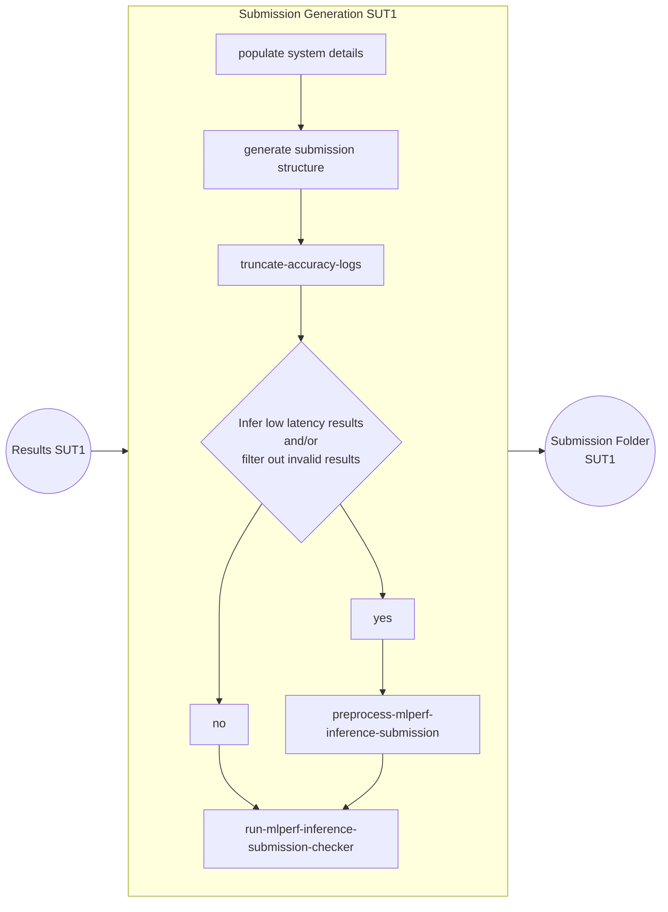
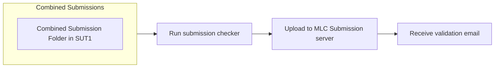

---
hide:
  - toc
---

Click [here](https://docs.google.com/presentation/d/1cmbpZUpVr78EIrhzyMBnnWnjJrD-mZ2vmSb-yETkTA8/edit?usp=sharing) to view the proposal slide for Common Automation for MLPerf Inference Submission Generation through MLCFlow.

Please refer to the [installation page](site:inference/install/) to install MLCFlow for automating the submission generation. In a typical development environment `pip install mlc-scripts` should be enough.

=== "Custom automation based MLPerf results"
    If you have not followed the `mlcr` commands under the individual model pages in the [benchmarks](../index.md) directory, please make sure that the result directory is structured in the following way. You can see the real examples for the expected folder structure [here](https://github.com/mlcommons/inference/tree/submission-generation-examples).
    ```
    └── System description ID(SUT Name)
        ├── system_meta.json
        └── Benchmark
            └── Scenario
                ├── Performance
                |   └── run_1 run for all scenarios
                |       ├── mlperf_log_summary.txt
                |       └── mlperf_log_detail.txt
                ├── Accuracy
                |   ├── mlperf_log_summary.txt
                |   ├── mlperf_log_detail.txt
                |   ├── mlperf_log_accuracy.json
                |   └── accuracy.txt
                |── Compliance_Test_ID
                |   ├── Performance
                |   |   └── run_x/#1 run for all scenarios
                |   |       ├── mlperf_log_summary.txt
                |   |       └── mlperf_log_detail.txt
                |   ├── Accuracy # for TEST01 only
                |   |   ├── baseline_accuracy.txt (if test fails in deterministic mode)
                |   |   ├── compliance_accuracy.txt (if test fails in deterministic mode)
                |   |   ├── mlperf_log_accuracy.json
                |   |   └── accuracy.txt
                |   ├── verify_performance.txt
                |   └── verify_accuracy.txt # for TEST01 only
                |── user.conf
                └── measurements.json
    ```
    
    <details>
    <summary>Click here if you are submitting in open division</summary>

    * The `model_mapping.json` should be included inside the SUT folder which is used to map the custom model full name to the official model name. The format of json file is:

    ```
        {
            "custom_model_name_for_model1":"official_model_name_for_model1",
            "custom_model_name_for_model2":"official_model_name_for_model2",

        }
    ```
    </details>

=== "MLC automation based results"
    If you have followed the `mlcr` commands under the individual model pages in the [benchmarks](../index.md) directory, all the valid results will get aggregated to the `mlc cache` folder. The following command could be used to browse the structure of inference results folder generated by MLCFlow.
    ### Get results folder structure

    === "Unix Terminal"
        ```bash
        mlc find cache --tags=get,mlperf,inference,results,dir | xargs tree
        ```
    === "Windows PowerShell"
        ```
        mlc find cache --tags=get,mlperf,inference,results,dir |  ForEach-Object { Get-ChildItem -Recurse $_ }
        ```


Once all the results across all the models are ready you can use the following the below section to generate a valid submission tree compliant with the [MLPerf requirements](https://github.com/mlcommons/policies/blob/master/submission_rules.adoc#inference-1).

## Generate submission folder

The submission generation flow is explained in the below diagram



### Command to generate submission folder

```bash
mlcr generate,inference,submission \
  --clean \
  --preprocess_submission=yes \
  --run_checker=yes \
  --submitter=MLCommons \
  --division=closed \
  --env.MLC_DETERMINE_MEMORY_CONFIGURATION=yes \
  --quiet
```
!!! tip
    * Use `--hw_name="My system name"` to give a meaningful system name. Examples can be seen [here](https://github.com/mlcommons/inference_results_v3.0/tree/main/open/cTuning/systems)

    * Use `--submitter=<Your name>` if your organization is an official MLCommons member and would like to submit under your organization

    * Use `--hw_notes_extra` option to add additional notes like `--hw_notes_extra="Result taken by NAME" `

    * Use `--results_dir` option to specify the results folder.  It is automatically taken from MLC cache for MLPerf automation based runs

    * Use `--submission_dir` option to specify the submission folder. (You can avoid this if you're pushing to github or only running a single SUT and MLC will use its cache folder)

    * Use `--division=open` for open division submission 

    * Use `--category` option to specify the category for which submission is generated(datacenter/edge). By default, the category is taken from `system_meta.json` file located in the SUT root directory.

    * Use `--submission_base_dir` to specify the directory to which the outputs from preprocess submission script and final submission is added. No need to provide `--submission_dir` along with this. For `docker run`, use `--submission_base_dir` instead of `--submission_dir`.


If there are multiple systems where MLPerf results are collected, the same process needs to be repeated on each of them. One we have submission folders on all the SUTs, we need to sync them to make a single submission folder

=== "Sync Locally"
    If you are having results in multiple systems, you need to merge them to one system. You can use `rsync` for this. For example, the below command will sync the submission folder from SUT2 to the one in SUT1. 
    ```
    rsync -avz username@host1:<path_to_submission_folder2>/ <path_to_submission_folder1>/
    ```
    Same needs to be repeated for all other SUTs so that we have the full submissions in SUT1.

    ```mermaid
        flowchart LR
            subgraph SUT1 [Submission Generation SUT1]
              A[Submission Folder SUT1]
            end
            subgraph SUT2 [Submission Generation SUT2]
              B[Submission Folder SUT2]
            end
            subgraph SUT3 [Submission Generation SUT3]
              C[Submission Folder SUT3]
            end
            subgraph SUTN [Submission Generation SUTN]
              D[Submission Folder SUTN]
            end
            SUT2 --> SUT1
            SUT3 --> SUT1
            SUTN --> SUT1
           
    ```

=== "Sync via a Github repo"
    If you are collecting results across multiple systems you can generate different submissions and aggregate all of them to a GitHub repository (can be private) and use it to generate a single tar ball which can be uploaded to the [MLCommons Submission UI](https://submissions-ui.mlcommons.org/submission). 

    Run the following command after **replacing `--repo_url` with your GitHub repository URL**.

    ```bash
    mlcr push,github,mlperf,inference,submission \
       --repo_url=https://github.com/mlcommons/mlperf_inference_submissions_v5.0 \
       --commit_message="Results on <HW name> added by <Name>" \
       --quiet
    ```

    > **Note:** The path to the locally synced submission directory from the output below can be used in the next step by passing it to the `--submission_dir` argument.
    <details>
  	<summary>Click to see the sample output</summary>
	```
  	[2025-07-23 16:36:56,399 module.py:2197 INFO] - 
    
    Path to the locally synced submission directory: mysubmissions/mlperf_submission

    
 	```
    </details>
    
    ```mermaid
        flowchart LR
            subgraph SUT1 [Submission Generation SUT1]
              A[Submission Folder SUT1]
            end
            subgraph SUT2 [Submission Generation SUT2]
              B[Submission Folder SUT2]
            end
            subgraph SUT3 [Submission Generation SUT3]
              C[Submission Folder SUT3]
            end
            subgraph SUTN [Submission Generation SUTN]
              D[Submission Folder SUTN]
            end
	    SUT2 -- git sync and push --> G[Github Repo]
	    SUT3 -- git sync and push --> G[Github Repo]
	    SUTN -- git sync and push --> G[Github Repo]
	    SUT1 -- git sync and push --> G[Github Repo]
           
    ```

## Upload the final submission
    
!!! warning
    If you are using GitHub for consolidating your results, make sure that you have run the [`push-to-github` command](#__tabbed_2_2) on the same system to ensure results are synced as is on the GitHub repository.

Once you have all the results on the system, you can upload them to the MLCommons submission server as follows:

=== "via CLI"
    You can do the following command which will run the submission checker and upload the results to the MLCommons submission server
    ```
    mlcr run,mlperf,submission,checker,inference \
    --submitter_id=<> \
    --submission_dir=<Path to the locally synced submission directory> --quiet
    ``` 
    
=== "via Browser"
    You can do the following command to generate the final submission tar file and then upload to the [MLCommons Submission UI](https://submissions-ui.mlcommons.org/submission). 
    ```
    mlcr run,mlperf,submission,checker,inference \
    --submission_dir=<Path to the submission folder> \
    --tar=yes \
    --submission_tar_file=mysubmission.tar.gz --quiet
    ```
    



<!--Click [here](https://youtu.be/eI1Hoecc3ho) to view the recording of the workshop: Streamlining your MLPerf Inference results using CM.-->
