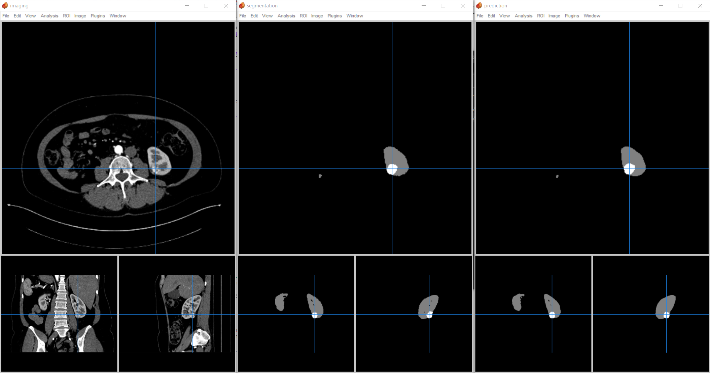
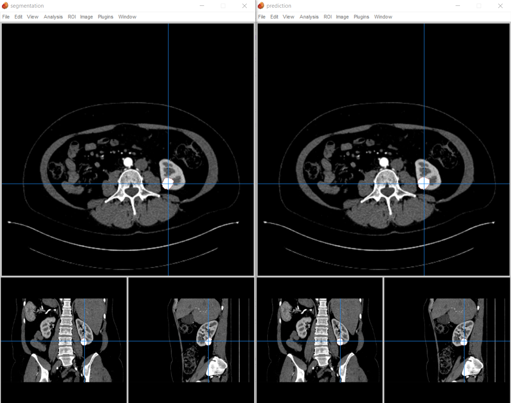

# MLPerf Inference Benchmarks for Medical Image 3D Segmentation

The chosen model is 3D-UNet ([3D U-Net](https://arxiv.org/abs/1606.06650), [nnUNet](https://github.com/MIC-DKFZ/nnUNet)) performing [KiTS 2019](https://kits19.grand-challenge.org/) kidney tumor segmentation task.

This model performing KiTS19 dataset for kidney tumor segmentation task is proposed to be used in MLPerf-Inference submissions from the year 2022.

[3D-UNet BraTS19 model](https://github.com/mlcommons/inference/tree/master/vision/medical_imaging/3d-unet-brats19), which has been used for MLPerf-Inference v0.7 and v1.0, is the valid model for the submissions until the end of year 2021. Please use BraTS19 model for v.1.1 submission.

Please see [this readme](README_cm.md) file for an automated way to run this benchmark out of the box and do an end-to-end submission with or without docker using the [MLCommons CM](https://github.com/mlcommons/ck/tree/master/cm) language.

## Prerequisites

If you would like to run on NVIDIA GPU, you will need:

- [nvidia-docker](https://github.com/NVIDIA/nvidia-docker)
- Any NVIDIA GPU supported by TensorFlow or PyTorch

## Supported Frameworks

| framework | accuracy | dataset | model link | model source | precision |
| --------- | -------- | ------- | ---------- | ------------ | --------- |
| PyTorch | **mean = 0.86170** kidney = 0.9347 tumor = 0.7887 | [Eval set](meta/inference_cases.json) of [KiTS 2019](https://kits19.grand-challenge.org/) | [from zenodo](https://zenodo.org/record/5597155) | Trained in PyTorch using codes from [MLPerf-Training](https://github.com/mlcommons/training/tree/master/image_segmentation/pytorch) | fp32 |
| PyTorch/checkpoint | **mean = 0.86170** kidney = 0.9347 tumor = 0.7887 | [Eval set](meta/inference_cases.json) of [KiTS 2019](https://kits19.grand-challenge.org/) | [from zenodo](https://zenodo.org/record/5597155) | Trained in PyTorch using codes from [MLPerf-Training](https://github.com/mlcommons/training/tree/master/image_segmentation/pytorch) | fp32 |
| ONNX | **mean = 0.86170** kidney = 0.9347 tumor = 0.7887 | [Eval set](meta/inference_cases.json) of [KiTS 2019](https://kits19.grand-challenge.org/) | [from zenodo](https://zenodo.org/record/5597155) | Converted from the PyTorch model using [script](unet_pytorch_to_onnx.py) | fp32 |
| Tensorflow | **mean = 0.86170** kidney = 0.9347 tumor = 0.7887 | [Eval set](meta/inference_cases.json) of [KiTS 2019](https://kits19.grand-challenge.org/) | [from zenodo](https://zenodo.org/record/5597155) | Converted from the ONNX model using [script](unet_onnx_to_tensorflow.py) | fp32 |

## Disclaimer
This benchmark app is a reference implementation that is not meant to be the fastest implementation possible.
This benchmark app is built by refactoring lots of codes from [MLPerf-Training 3D-UNet](https://github.com/mlcommons/training/blob/master/image_segmentation/pytorch) and [MLPerf-Inference 3D-UNet BraTS](https://github.com/mlcommons/inference/tree/master/vision/medical_imaging/3d-unet)

## Commands

Please run the following commands, in the suggested order:

- `git clone https://github.com/mlcommons/inference.git`
- `cd [.../inference]/vision/medical_imaging/3d-unet-kits19`
- `make setup`
- `make build_docker`
- `make launch_docker`
- `make preprocess_data`
- `make run_[backend]_[test]`
  - `backend` choices: `pytorch`, `pytorch_checkpoint`, `onnxruntime`, `tensorflow`
  - `test` choices: `accuracy`, `performance`

Other useful commands:
- `make preprocess_calibration_data`: preprocess calibration dataset
- `make convert_onnx_model`: convert pytorch model to ONNX
- `make convert_tensorflow_model`: convert ONNX model to TensorFlow
- `make download_kits19_and_duplicate`: manually download KITS19 raw data and duplicate case_00185 as case_00400
- `make download_models`: manually download all the models (pytorch, ONNX, tensorflow)
- `python3 run.py --backend=[tensorflow|pytorch|pytorch_checkpoint|onnxruntime] --scenario=[Offline|SingleStream|MultiStream|Server] [--accuracy] --model=[path/to/model]`: run the harness inside the docker container. Performance or Accuracy results will be printed in console
- `python3 accuracy_kits.py --log_file=<LOADGEN_LOG>`: compute accuracy from a LoadGen accuracy JSON log file

## Details

- Baseline SUT that connects LoadGen and QSL is in [base_SUT.py](base_SUT.py). QSL implementation is in [kits_QSL.py](kits_QSL.py).
- SUT implementations for the above supported backends are in [pytorch_SUT.py](pytorch_SUT.py), [pytorch_checkpoint_SUT.py](pytorch_checkpoint_SUT.py), [onnxruntime_SUT.py](onnxruntime_SUT.py), and [tensorflow_SUT.py](tensorflow_SUT.py).
  - PyTorch/checkpoint model uses the checkpoint generated from training as it is, whereas PyTorch model uses JIT compiled serve-ready model.
- The script [accuracy_kits.py](accuracy_kits.py) parses LoadGen accuracy log, post-processes it, and computes the accuracy.
- Preprocessing and evaluation (including post-processing) are not included in the timed path.
- Unlike BraTS19 data, KiTS19 data come in various shapes with various voxel spacing. In this app, we preprocess images and labels so that they are under same voxel spacing and ready for sub-volume inferencing.
- When preprocessing is finished, reshaped imaging/segmentation NIfTI files are also populated under preprocessed data directory, specifically under `nifti` sub-directory.
- When postprocessing is finished, either as part of `make run_[backend]_accuracy` or `python3 accuracy_kits.py`, prediction results, i.e. segmentations done by inference, are populated in the postprocess data directory, together with `summary.csv` file showing DICE scores of Kidney segmentation and Tumor segmentation.
- User can view these NIfTI files with NIfTI viewers like [Mango](http://ric.uthscsa.edu/mango/) as below:
  - Image, Segmentation:ground-truth, Segmentation:prediction
    
  - Overlaid Image with Segmentation:ground-truth, Overlaid Image with Segmentation:prediction
    

## Calibration Set

The calibration set is determined to have 20 images listed in [Calibration set](meta/calibration_cases.json). They are randomly selected from the training set used in [MLPerf-Training 3D-UNet](https://github.com/mlcommons/training/blob/master/image_segmentation/pytorch). None of the image in the calibration set is included in the inference set.

## License

Apache License 2.0
